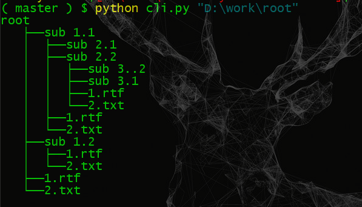

# Directory Tree Generator
### _by Arvind Rathee_

Command-line application that takes a directory path as an argument, walks through its internal structure,\
and generates a treelike diagram listing the contents of the directory at hand.

## Project Content

Directory-Tree-Generator\
    ├──img\
    │   └──sample.PNG\
    ├──cli.py\
    ├──README.md\
    └──tree.py

## Requirements

Language Used: Python 3\
Modules Used : pathlib and argparse

## How to run the program?

- Download the project zip file to you computer and unzip the file. Or clone this
repository to your desktop.

- Navigate to the project directory.

- Type following command

```commandline
python cli.py "path-to-folder"
```

Above code will generate the Directory Tree structure and display it on command line.\
If needed ouput can be saved to text file by adding -f/--file argument to the command

```commandline
python cli.py "path-to-folder" -f=True
```

## Sample Output



